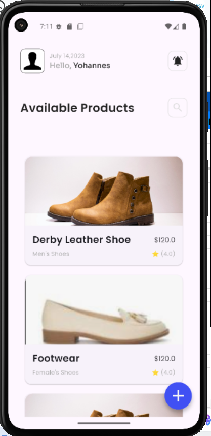
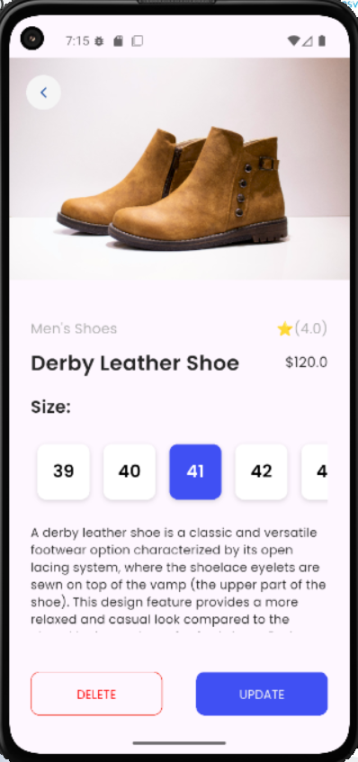
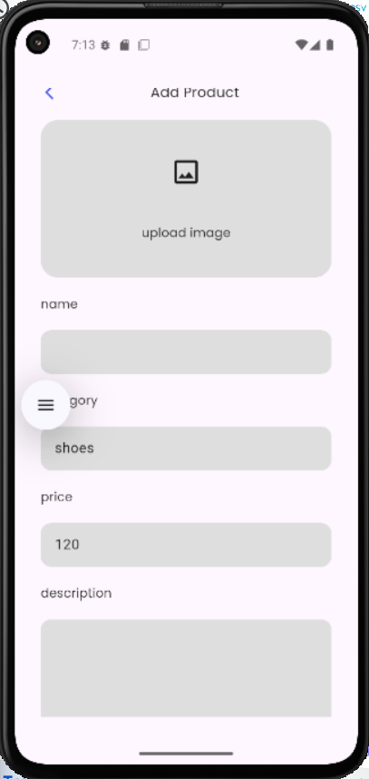
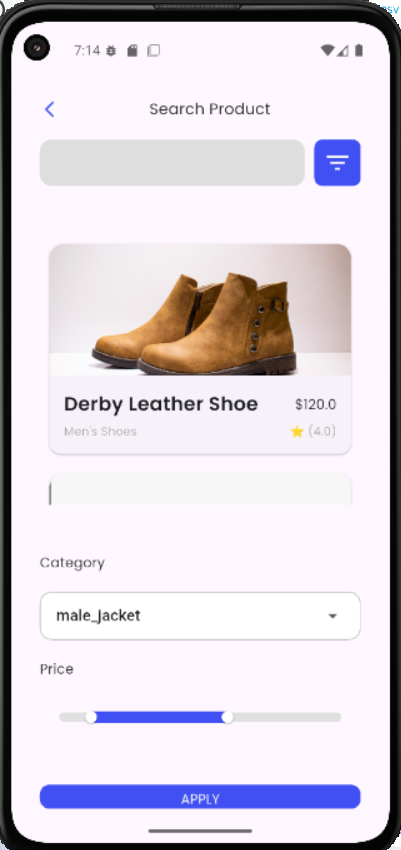

# 🛍️ Simple E-Commerce Flutter App

This project is a basic Flutter mobile application designed to demonstrate
 **navigation and routing** features in an e-commerce context. 
 Users can **view**, **create**, **update**, and **delete** products.

## 📱 App Features

- ✅ **Home Screen** – Displays a list of all products.

- ✅ **Product Details Screen** – View detailed information about a selected product.

- ✅ **Add/Edit Product Screen** – Create a new product or edit an existing one.

- ✅ **Named Routing** – Uses Flutter’s named routes for clean navigation.

- ✅ **Data Passing Between Screens** – Product data is passed seamlessly between screens.

- ✅ **Navigation Animations** – Smooth transitions enhance user experience.

- ✅ **Back Navigation Handling** – Proper back button behavior across screens.


## 🚀 Getting Started
### 1. Clone the Repository

```
git clone https://github.com/game-ale/flutter-ecommerce-navigation.git
cd flutter-ecommerce-navigation
```
2. Install Dependencies
```
flutter pub get
```
3. Run the App

```
flutter run
```
Make sure a device/emulator is connected before running the app.

📂 Project Structure

```
lib/
┣ 📂common
┃ ┣ 📂themes
┃ ┃ ┣ 📜app_colors.dart
┃ ┃ ┗ 📜text_styles.dart
┃ ┗ 📂widgets
┃   ┣ 📜icons_box.dart
┃   ┣ 📜input_inserted.dart
┃   ┗ 📜input_type_name.dart
┣ 📂components
┃ ┣ 📜product_card.dart
┃ ┣ 📜product_category.dart
┃ ┣ 📜rating.dart
┃ ┗ 📜shoe_sizes.dart
┣ 📂pages
┃ ┣ 📜add_update_page.dart
┃ ┣ 📜details_page.dart
┃ ┣ 📜home_page.dart
┃ ┗ 📜search_page.dart
┣ 📂product_models
┃ ┣ 📜product_manager.dart
┃ ┣ 📜product.dart
┃ ┗ 📜sample_products.dart
┗ 📜main.dart
```

🔄 Navigation Overview
From	To	Trigger
Home Screen	Product Detail	Tap on product card
Home Screen	Add Product	Tap "Add" button
Product Detail	Edit Product	Tap "Edit" icon
Add/Edit Screen	Back to Home	Save or press back button

Named routes are used throughout to ensure a maintainable and scalable codebase.

✨ Screenshots


### 🏠 Home Screen


### 📄 Product Detail Screen


### ➕ Add/Edit Product Screen


### search of product 



📘 Additional Notes
The app uses in-memory product data; no external database is used.

Navigation transitions are implemented using PageRouteBuilder with animations.

Designed with Flutter best practices in mind for readability and scalability.


