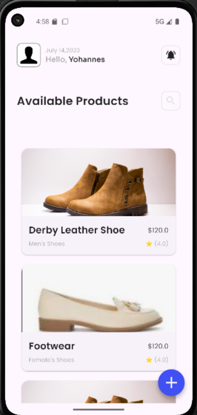
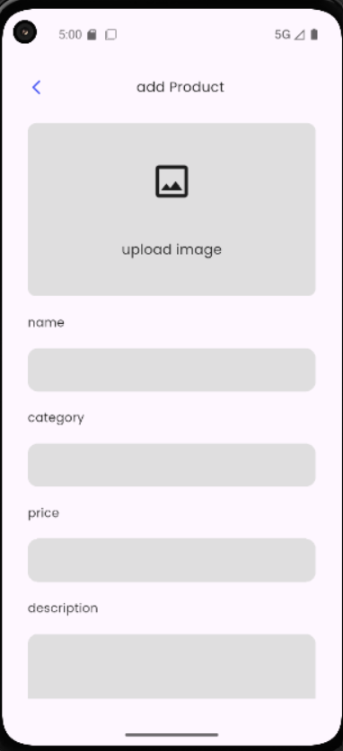
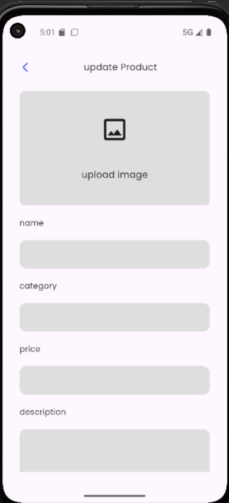

# 🛍️ Flutter eCommerce App – Navigation & Routing

This project is a simple Flutter-based eCommerce mobile application that demonstrates
 clean **navigation and routing** practices. Users can **create**, **view**, **edit**,
  and **delete** products using smooth transitions and named routes.

---

## 📱 Features

### ✅ Core Screens
- **Home Screen**: Displays a list of all products.

- **Product Details Screen**: Shows full details of a selected product.

- **Add/Edit Product Screen**: Allows users to add a new product or edit an existing one.

### 🚀 Navigation Features

- **Named Routes**: Navigation is managed via clearly defined route names for maintainability.

- **Smooth Animations**: Custom page transitions enhance the user experience.

- **Data Passing**: Product data is passed between screens for creation and editing.

- **Back Navigation**: The back button behavior is handled gracefully and predictably.


---

## 🧭 Route Structure


| Screen                | Route Name           |
|----------------------|----------------------|
| Home Screen          | `/`                  |
| Product Details      | `/product-details`   |
| Add/Edit Product     | `/edit-product`      |

---

## 📂 Project Structure

```
lib/
┣ 📂common
┃ ┣ 📂themes
┃ ┃ ┣ 📜app_colors.dart
┃ ┃ ┗ 📜text_styles.dart
┃ ┗ 📂widgets
┃   ┣ 📜icons_box.dart
┃   ┣ 📜input_inserted.dart
┃   ┗ 📜input_type_name.dart
┣ 📂components
┃ ┣ 📜product_card.dart
┃ ┣ 📜product_category.dart
┃ ┣ 📜rating.dart
┃ ┗ 📜shoe_sizes.dart
┣ 📂pages
┃ ┣ 📜add_update_page.dart
┃ ┣ 📜details_page.dart
┃ ┣ 📜home_page.dart
┃ ┗ 📜search_page.dart
┣ 📂product_models
┃ ┣ 📜product_manager.dart
┃ ┣ 📜product.dart
┃ ┗ 📜sample_products.dart
┗ 📜main.dart
```


---

## 🛠️ How to Run

1. **Clone the repository**:
```
   git clone https://github.com/game-ale/2025-internship-mobile-tasks_.git
   
   cd 2025-internship-mobile-tasks_

```
Install dependencies:
```
flutter pub get
Run the app:
```

📌 Key Concepts Implemented
Navigator.pushNamed & Navigator.pop

onGenerateRoute and custom route logic

Data transfer via constructor and ModalRoute.of(context)

Back navigation via WillPopScope and system back button

## Screenshots
Home Screen	Product Form	Product Details


### Home Screen


### add product


### Product Details


### update Product

